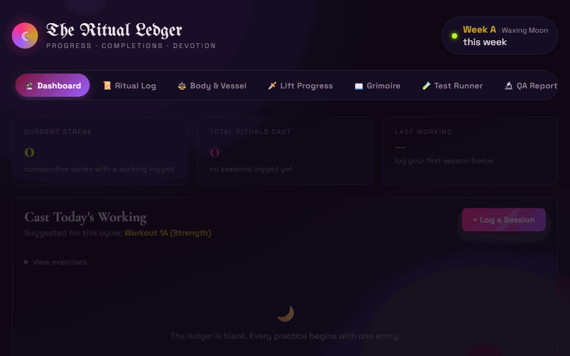
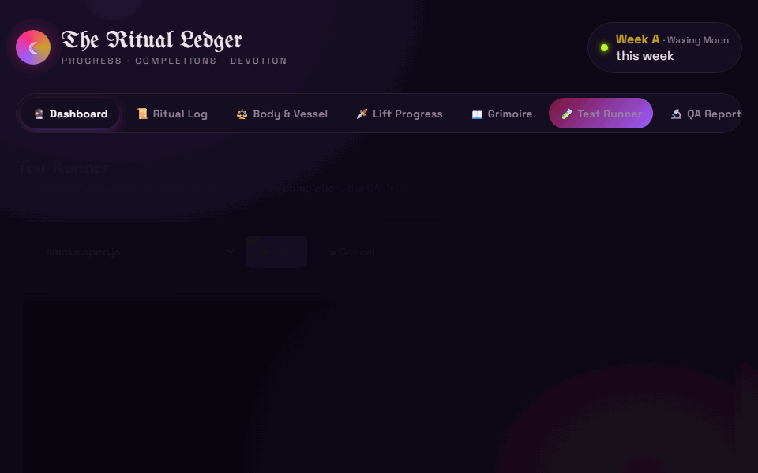
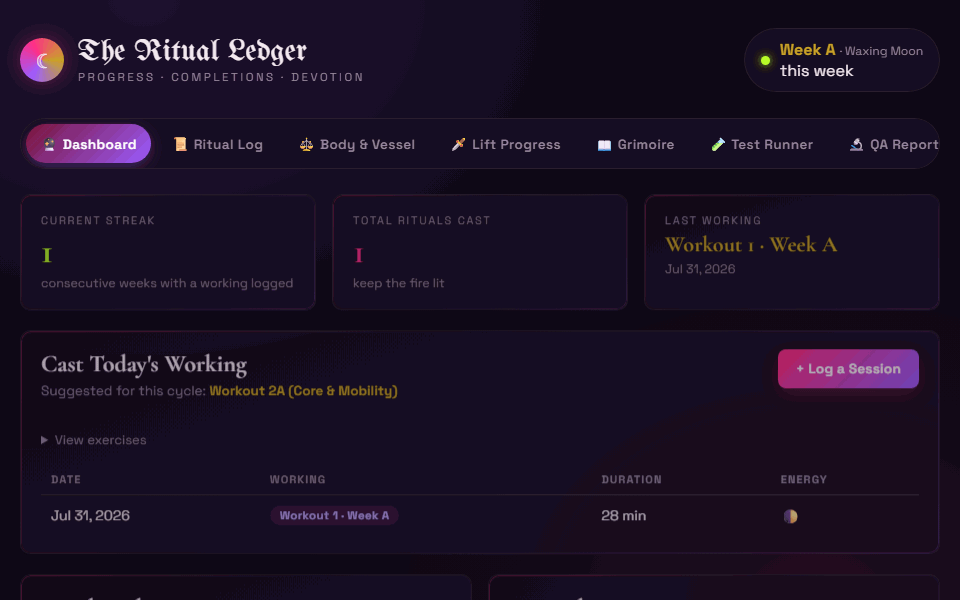

# 🕯️ Ritual of Strength

**progress · completions · devotion**

*A witchy workout ledger — and, more to the point, a demonstration of senior QA test
engineering practice.*

---

## ✦ What this actually is

The app underneath is real — a personal Node/Express + SQLite workout tracker its owner
actually uses. But **the app is the system under test; the test engineering around it is the
deliverable.** This repo exists to show how I approach quality on a real, working codebase:
Playwright suites with deliberate structure, a themed and self-hosted Allure report, an
in-app tool to run test suites live, and a CI pipeline that gates all of it.

Jump straight to [the QA / test engineering feature set](#qa-feature-set)
or [try it yourself](#try-it-yourself).

---

## ✦ See it in motion

| The app | The Test Runner, live | The QA Report, self-hosted |
|---|---|---|
|  |  |  |

---

<a id="qa-feature-set"></a>
## ✦ QA / Test Engineering Feature Set

- **Playwright coverage, API and UI** — [`tests/api.spec.js`](tests/api.spec.js) and
  [`tests/smoke.spec.js`](tests/smoke.spec.js) exercise the REST surface and the real browser
  UI, grouped by feature with `test.describe()` and broken into named `step()`s so a report
  reads like a story, not just a pass/fail.
- **Page Object Model** — UI tests drive the app exclusively through
  [`tests/pages/RitualLedgerPage.js`](tests/pages/RitualLedgerPage.js), not raw locators
  scattered inline.
- **Allure annotations that mean something** — every test carries `epic` / `feature` /
  `story` / `severity` / `owner` tags (`allure-js-commons`), so the generated report is
  actually browsable by area and risk, not just a flat list of test names.
- **A themed, self-hosted Allure report** — the "Awesome" report is generated with
  `allure awesome`, then re-skinned post-generation ([`src/allure-theme.css`](src/allure-theme.css),
  [`src/themeAllureReport.js`](src/themeAllureReport.js)) to match the app's own void/pink/
  violet palette — deliberately *without* touching the pass/fail/broken/skipped status colors,
  since those carry standard QA meaning that shouldn't be sacrificed for branding.
- **Local run-history trends** — every regeneration appends to a local `data/allure-history.jsonl`
  via `--history-path` (gitignored — it's local run state, not repo content), so the report's
  trend charts show real run-over-run history, not a single snapshot.
- **An in-app Test Runner** — not just a `tests/` folder to take on faith. A "🧪 Test Runner"
  tab runs the real Playwright suite from the browser, streams output live over SSE, supports
  mid-run cancellation, and auto-regenerates the Allure report on completion.
- **CI that actually gates this** — [`.github/workflows/ci.yml`](.github/workflows/ci.yml)
  runs lint, the full Playwright suite (with `eslint-plugin-playwright` catching
  Playwright-specific antipatterns like a missing `await` on `expect()`), and a Docker build
  in parallel on every PR, uploading the Playwright HTML and Allure reports as artifacts even
  when a run fails.

---

<a id="try-it-yourself"></a>
## ✦ Try it yourself

Don't just read the `tests/` folder — run it:

1. **Start the app** (see [Getting Started](#-getting-started) below), then open the
   **🧪 Test Runner** tab and hit **Run**. Watch the suite execute live, right in the browser.
2. Open the **🔬 QA Report** tab afterward to see the themed Allure report the run you just
   watched actually produced — full annotations, history trends, the works.
3. **Look at the Docker setup** — [`Dockerfile`](Dockerfile) is a multi-stage build on
   `node:22-alpine` with a non-root runtime user and build-only tooling (the `python3 make g++`
   toolchain `better-sqlite3` needs at install time) confined entirely to the builder stage.
   The final image bakes in a snapshot of the Allure report for fully self-contained hosting —
   `docker compose up` serves the whole thing, tests and all, with nothing external required.

---

## ✦ What the app does

- **Ritual Log** — log workout sessions (duration, energy, notes), edit or delete them later.
- **Body & Vessel** — track bodyweight and body measurements over time.
- **Lift Progress** — log lifts with sets/reps/weight and an "ordeal level" difficulty rating.
- **Grimoire of Strength** — a printable, illuminated-manuscript-styled rendition of a
  workout plan, generated straight from a plain-markdown source file
  ([`custom-workout-plan.md`](custom-workout-plan.md)) via a small parser/generator pipeline.
- **Data export/import** — full JSON backup and restore.

---

## ✦ Tech Stack

**App:** Node.js, Express, `better-sqlite3`, vanilla JS (no frontend framework) · **Testing:**
Playwright, `allure-js-commons`/`allure-playwright`, ESLint + `eslint-plugin-playwright` ·
**Reporting:** Allure "Awesome" report, themed and self-hosted · **CI/CD:** GitHub Actions ·
**Containerization:** Docker (multi-stage, Alpine, non-root)

---

## ✦ Getting Started

**Locally:**
```bash
npm install
npm start
# → http://localhost:3000
```

**With Docker** (bakes in a snapshot of the Allure report for a fully self-contained image):
```bash
npm run docker:build   # ensures a report snapshot exists, then builds the image
docker compose up
```

## ✦ Running the QA tooling locally

```bash
npm run test:e2e:report   # run the full Playwright suite, then regenerate the Allure report
npm run allure:open       # open the generated report directly
```

Or skip the terminal entirely and use the in-app **🧪 Test Runner** tab described above.

---

## ✦ A note on the QA Report

The Allure "Awesome" report bundles its own Google Analytics snippet by default — that's
Allure's own toolchain telemetry, not anything added by this project, and no supported
opt-out was found. Worth knowing if you're serving `/allure-report` publicly yourself.

---

## ✦ License

[MIT](LICENSE)

---

## ✦ Why I Built This

I'm a senior QA engineer with over 10 years of experience in test planning, execution, and automation. I advocate for and specialize in a shift-left testing strategy with a focus on building and automating test coverage across the entire system. Invest in quality at the foundational level, then enjoy the magic. ✨

---

<p align="center"><i>✦ so mote it be ✦</i></p>
