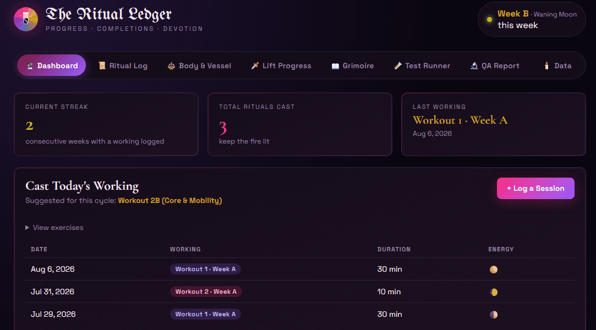
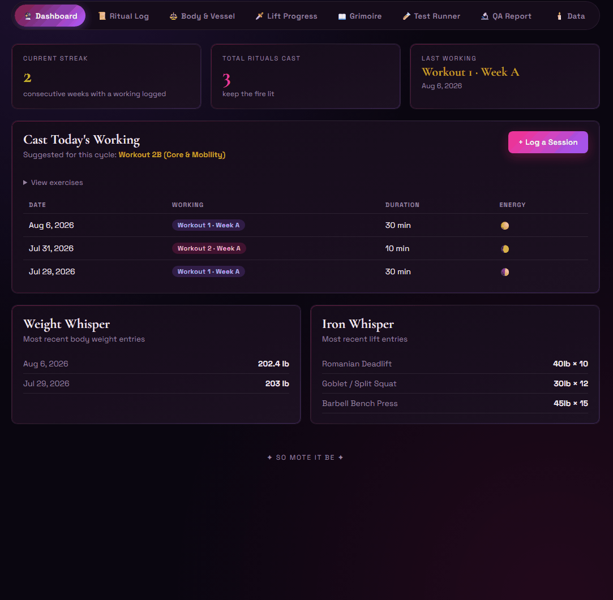

# 🕯️ Ritual of Strength

[](https://github.com/raquelaroots/grimoire-of-strength/actions/workflows/ci.yml)
[](tests/)
[](k8s/)
[](helm/ritual-ledger/)
[](Dockerfile)
[](LICENSE)

**progress · completions · devotion**

*A way to track my workouts — and, more to the point, a demonstration of senior QA test
engineering practice.*

**[🔮 Read my professional portfolio →](https://raquelaroots.github.io/grimoire-of-strength/)**

---

## ✦ This Repo

The app underneath is real — a personal Node/Express + SQLite workout tracker that I use. But **the app is the system under test; the test engineering around it is the star of the show.** This repo exists to show how I approach quality on a real, working codebase: Playwright suites with deliberate structure, a themed and self-hosted Allure report, an in-app tool to run test suites live, and a CI pipeline that gates all of it.

Jump straight to [the QA / test engineering feature set](#qa-feature-set),
[try it yourself](#try-it-yourself), or [the Kubernetes/Helm deployment](#kubernetes-helm).



---

<a id="qa-feature-set"></a>
## ✦ 🧪 QA / Test Engineering Feature Set

- **Playwright coverage, API and UI** — [`tests/api.spec.js`](tests/api.spec.js) and
  [`tests/smoke.spec.js`](tests/smoke.spec.js) exercise the REST surface and the real browser
  UI, grouped by feature with `test.describe()` and broken into named `step()`s so a report
  reads like a story, not just a pass/fail.
- **Page Object Model** — UI tests drive the app exclusively through
  [`tests/pages/RitualLedgerPage.js`](tests/pages/RitualLedgerPage.js), not raw locators
  scattered inline.
- **Allure annotations that mean something** — every test carries `epic` / `feature` /
  `story` / `severity` / `owner` tags (`allure-js-commons`), so the generated report is
  actually browsable by area and risk, not just a flat list of test names.
- **A themed (because of course), self-hosted Allure report** — the "Awesome" report is generated with `allure awesome`, then re-skinned post-generation ([`src/allure-theme.css`](src/allure-theme.css), [`src/themeAllureReport.js`](src/themeAllureReport.js)) to match the app's own void/pink/violet palette.
- **Local run-history trends** — every test report regeneration appends to a local `data/allure-history.jsonl` via `--history-path` (gitignored — it's local run state, not repo content), so the report's trend charts show real run-over-run history.
- **An in-app Test Runner** — not just a `tests/` folder to take on faith. A "🧪 Test Runner"
  tab runs the real Playwright suite from the browser, streams output live over SSE, supports
  mid-run cancellation, and auto-regenerates the Allure report on completion.
- **CI that actually gates this** — [`.github/workflows/ci.yml`](.github/workflows/ci.yml)  runs lint, the full Playwright suite (with `eslint-plugin-playwright` catching   Playwright-specific antipatterns like a missing `await` on `expect()`), and a Docker build   in parallel on every PR, uploading the Playwright HTML and Allure reports as artifacts even   when a run fails.



---

<a id="try-it-yourself"></a>
## ✦ Try it yourself

If you don't just want to read the `tests/` folder:

✨ **Start the app** (see [Getting Started](#-getting-started) below), then open the
   **🧪 Test Runner** tab and hit **Run**. Watch the suite execute live, right in the browser.
✨ Open the **🔬 QA Report** tab afterward to see the themed Allure report the run you just
   watched actually produced — full annotations, history trends, the works.  
✨ **The Container** — [`Dockerfile`](Dockerfile) is a multi-stage build on
   `node:22-alpine` with a non-root runtime user and build-only tooling confined entirely to the builder stage. The final image bakes in a snapshot of the Allure report for fully self-contained hosting.
✨ **The Deployed** — [`k8s/`](k8s/) and [`helm/ritual-ledger/`](helm/ritual-ledger/)
   deploy the same app to a real cluster, with a `CronJob` re-running the test suite and Allure report on a schedule. [More below](#kubernetes-helm).

---

<a id="kubernetes-helm"></a>
## ✦ 🚀 Kubernetes / Helm Deployment

This repo can also deploy to a real Kubernetes cluster — the same kind of
setup I deploy and maintain at my day job on a Helm-managed cluster, applied here to my own
project.

- **[`k8s/`](k8s/)** — raw, literal manifests. No templating, nothing hidden behind values —
  a `Namespace`, two `ServiceAccount`s, a `ConfigMap` for the plan file, two `PersistentVolumeClaim`s, a single-replica `Deployment`, a `Service`, a `CronJob`, and an optional `Ingress`. Read these first if you want to see exactly what's actually deployed.
- **[`helm/ritual-ledger/`](helm/ritual-ledger/)** — the same resource set, packaged as a proper Helm chart with a `values.yaml`, a `fail`-guarded single-replica constraint, and its own [README](helm/ritual-ledger/README.md) covering every value and the deliberate tradeoffs made.

🔮 **Honestly verified, not just written:** every manifest and the chart were validated against a real local [kind](https://kind.sigs.k8s.io/) cluster while building this — `helm lint`, rendered output applied for real, the Deployment actually reaching `Ready`, the `CronJob`'s `Job` triggered manually and watched through to a completed test run and a regenerated report the app pod then served over the shared PVC, and a `helm uninstall` confirmed to keep the data PVCs. No cluster is kept running for this repo day-to-day, so treat the above as a tested recipe, not a live deployment.

---

## ✦ What the app does

- **Ritual Log** — log workout sessions (duration, energy, notes), edit or delete them later.
- **Body & Vessel** — track measurements over time.
- **Lift Progress** — log lifts with sets/reps/weight and an "ordeal level" difficulty rating.
- **Grimoire of Strength** — a printable, illuminated-manuscript-styled rendition of a   workout plan, generated straight from a plain-markdown source file ([`custom-workout-plan.md`](custom-workout-plan.md)) via a small parser/generator pipeline.
- **Data export/import** — full JSON backup and restore.


---

## ✦ Home Assistant Integration

A dedicated `/api/ha/*` surface lets an external system — Home Assistant, in my case — log lifts
and read a workout summary, kept separate from the app's own unauthenticated browser-facing
routes so a public repo never needs to embed a secret in client-side JS.

- **`POST /api/ha/lifts`** — create a lift entry. Requires `Authorization: Bearer
  <RITUAL_HA_API_KEY>`, compared in constant time (`crypto.timingSafeEqual`); the route fails
  closed (`503`) if the key isn't configured, rather than silently allowing unauthenticated
  writes. Payloads are validated by the same [`src/liftValidation.js`](src/liftValidation.js)
  the app's own `POST /api/lifts` uses, so a malformed request gets a clean `400`, not a raw 500.
- **`GET /api/ha/workout-summary`** — unauthenticated, matching every other read route in the
  app. Returns the same "Cast Today's Working" suggestion the dashboard itself computes — a
  faithful backend port ([`src/workoutSummary.js`](src/workoutSummary.js)) of the frontend's own
  algorithm, not a reimplementation that could quietly drift from what the UI shows.
- The Grimoire (`/grimoire-of-strength.html`) has no framing restriction, so it can be embedded
  directly in a dashboard `iframe` card.

```bash
curl -X POST http://localhost:3000/api/ha/lifts \
  -H "Authorization: Bearer $RITUAL_HA_API_KEY" \
  -H "Content-Type: application/json" \
  -d '{"exercise":"Squat","weight":135,"sets":3,"reps":5}'
```

Covered by [`tests/api.spec.js`](tests/api.spec.js)'s "Home Assistant Integration" suite: the
auth round trip, validation-with-a-valid-key, and a regression test proving the workout-summary
suggestion actually flips after a new completion, not just that it returns *something*.

---

## ✦ Tech Stack

**App:** Node.js, Express, `better-sqlite3`, vanilla JS (no frontend framework) · **Testing:**
Playwright, `allure-js-commons`/`allure-playwright`, ESLint + `eslint-plugin-playwright` ·
**Reporting:** Allure "Awesome" report, themed and self-hosted · **CI/CD:** GitHub Actions ·
**Containerization:** Docker (multi-stage, Alpine, non-root), Kubernetes, Helm

---

## ✦ Getting Started

**Locally:**
```bash
npm install
npm start
# → http://localhost:3000
```

**With Docker** (bakes in a snapshot of the Allure report for a fully self-contained image):
```bash
npm run docker:build   # ensures a report snapshot exists, then builds the image
docker compose up
```

## ✦ Running the QA tooling locally

```bash
npm run test:e2e:report   # run the full Playwright suite, then regenerate the Allure report
npm run allure:open       # open the generated report directly
```

Or skip the terminal entirely and use the in-app **🧪 Test Runner** tab described above.

---

## ✦ License

[MIT](LICENSE)

---

## ✦ Why I Built This

I'm a senior QA engineer with over 10 years of experience in test planning, execution, and automation. I advocate for and specialize in a shift-left testing strategy with a focus on building and automating test coverage across the entire system. Invest in quality at the foundational level, then enjoy the magic. ✨

---

<p align="center"><i>✦ every assertion, a small spell ✦</i></p>
